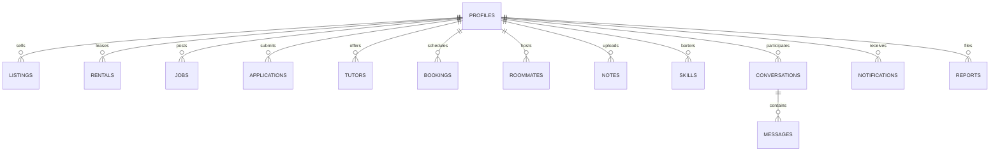

# Quadly 🎓 (CampusHub 2.0)

<div align="center">


### **The Decentralized 3D University Operating System & Campus Economy**

[](https://campub-hub.vercel.app/)
[](https://react.dev/)
[](https://vitejs.dev/)
[](https://tailwindcss.com/)
[](https://www.framer.com/motion/)
[](https://supabase.com/)

<p align="center">
  <a href="#-key-features--ecosystem-modules">Features</a> •
  <a href="#-3d-visual-engine--motion-design-system">3D Motion Engine</a> •
  <a href="#-streamlined-navigation-architecture">Navigation Hub</a> •
  <a href="#-architecture--relational-data-matrix">Data Matrix</a> •
  <a href="#-quick-start">Quick Start</a> •
  <a href="#-deployment">Deployment</a>
</p>

</div>

---

## 🌟 Overview

**Quadly (CampusHub)** is a modern, high-performance college ecosystem designed to modernize fragmented campus life. It unifies **student commerce, short-term gear rentals, verified on-campus gigs, roommate matching, peer tutoring, barter skill exchanges, and crowdsourced course notes** into a cohesive, holographic 3D cyber-aesthetic interface.

Built from the ground up on **React 19**, **Vite 8.3**, and **Tailwind CSS v4**, Quadly features an interactive 3D particle canvas, gyroscopic mouse-tilt cards with specular light sheen, seamless layoutId gliding navigation pills, and an instant multi-persona switcher for realistic student role simulation.

---

## 🚀 Key Features & Ecosystem Modules

### 1. 🛍️ Verified Student Marketplace (`/marketplace`)
* **Zero-Commission Trading**: Peer-to-peer commerce restricted to verified campus students.
* **Smart Categorization**: Textbooks, Laptops & Tech, Dorm Essentials, Lab Gear, and Apparel.
* **Condition & Price Matrix**: Granular filtering across *Brand New, Like New, Good,* and *Fair* condition ratings.
* **3D Specular Product Cards**: Realistic tilt physics with neon cyan accents, hover elevation, and image error self-healing.
* **Safety & Escrow Flags**: Designates verified campus pickup locations (Library Quad, Student Center, Dining Hall).

### 2. 📸 Gear & Tech Rentals (`/rentals`)
* **Short-Term Student Leases**: Rent high-value equipment without retail costs (DSLR cameras, graphing calculators, lab microscopes, gaming consoles, drones, and e-scooters).
* **Flexible Date Calculator**: Automatically computes total rental duration and dynamic rates per day.
* **Security Deposit Escrow**: Outlines refundable deposit guarantees and pre-rental inspection notes.

### 3. 💼 Campus Jobs & Gigs (`/jobs`)
* **Student-Friendly Roles**: Research lab assistantships, campus IT helpdesk, dining hall supervisors, event staff, and peer design gigs.
* **Wage & Compensation Filters**: Filter by hourly wage ($15/hr to $45+/hr), on-campus vs. remote, and time commitment.
* **1-Click Application Flow**: Students submit custom elevator pitches and profile credentials directly to posters.

### 4. 🏠 Roommate & Sublet Matcher (`/roommates`)
* **Lifestyle Compatibility Scoring**: Match with peers based on study habits, sleep schedules, cleanliness preferences, and major.
* **Dorm & Apartment Sublets**: Browse verified sublease rooms, flat vacancies, and lease terms (Fall, Spring, Full Year).
* **Direct Roommate Inquiries**: Reach out directly to listing creators with mutual roommate preference cards.

### 5. 🎓 1-on-1 Peer Tutoring (`/tutoring`)
* **High-Achieving Classmates**: Connect with top-tier student tutors in Computer Science, Calculus, Organic Chemistry, and Physics.
* **Instant Session Booking**: Select subject, preferred date, and time slot with interactive confirmation modals.
* **Trust & Rating System**: Star ratings, verified course grades (e.g. *Grade: A+ in CS 189*), and hourly rates.

### 6. ⚡ Barter Skill Exchange (`/skills`)
* **Currency-Free Skill Trading**: Swap skills directly without cash transactions.
* **Mutual Barter Matches**: Trade Python/React web development for UI/UX Figma design, guitar lessons for conversational Spanish, or video editing for calculus prep.
* **Instant Proposal Modal**: Submit structured skill swap offers with portfolio references.

### 7. 📝 High-Yield Course Notes & Exam Decks (`/notes`)
* **Crowdsourced Academic Repository**: Semester lecture decks, solved midterms, midterm formula sheets, and lab guides.
* **Departmental Filters**: Search by course code (e.g., *CS 61A, ECON 101, CHEM 1A*).
* **Direct Previews & Upvotes**: Rate high-quality student contributions and preview study outlines.

### 8. 🛡️ Trust Matrix & Admin Governance (`/admin`)
* **Platform Security**: Real-time moderation desk with flag inspection and automated user report queues.
* **Campus ID Verification**: Visual badges for student credentials and 99% trust score algorithms.
* **Community Integrity**: Action buttons to review, dismiss, or ban duplicate and suspicious posts.

---

## 🎨 3D Visual Engine & Motion Design System

Quadly features an advanced dark-mode glassmorphic aesthetic inspired by cyberpunk terminal interfaces and modern spatial operating systems:

```
┌────────────────────────────────────────────────────────────────────────┐
│                        3D SPATIAL PRESENTATION                         │
├────────────────────────────────────────────────────────────────────────┤
│  [Canvas3D Particle Matrix]   ──> WebGL/Canvas Starfield Parallax      │
│  [Card3D Gyroscopic Engine]  ──> RotateX/Y + Specular Sheen Reflections│
│  [LayoutId Gliding Indicators]──> Spring Physics Pill Transitions       │
│  [Glassmorphic Backdrops]     ──> 95% Dark Glass + 40px Backdrop Blur  │
│  [Volumetric Ambient Auroras] ──> Radial Glowing Cyan/Purple Backlights│
│  [Command Palette ⌘K]         ──> Holographic Spotlight Quick-Search    │
└────────────────────────────────────────────────────────────────────────┘
```

* **Interactive Particle Matrix (`Canvas3D.jsx`)**: HTML5 Canvas rendering floating geometric nodes that track mouse velocity and react to viewport cursor motion.
* **3D Perspective Tilt Cards (`Card3D.jsx`)**: Uses CSS 3D perspective transforms (`perspective(1000px) rotateX(...) rotateY(...) scale3d(...)`) with dynamic reflection shine following the mouse pointer.
* **Spring Physics**: Powered by **Framer Motion v13** with tuned dampening (`stiffness: 450, damping: 25`) for tactile hover and click states.
* **Gliding Hover Pills**: Uses Framer Motion's shared `layoutId="navbarHoverPill"` to glide between navigation items seamlessly without abrupt jumps.

---

## 🧭 Streamlined Navigation Architecture

The navigation header (`src/components/layout/Navbar.jsx`) was re-engineered to provide an ultra-clean, intuitive experience without visual clutter:

| Section | Elements & Components | Interaction Model |
| :--- | :--- | :--- |
| **Brand Identity** | `BrandLogo` (Scalable vector mark + wordmark) | Direct link to home `/` with 3D OS badge |
| **Primary Hub** | **Marketplace** (`/marketplace`) | Direct 1-click trade link with gliding hover pill |
| **Campus Life ▾** | **Gear Rentals** • **Jobs & Gigs** • **Roommates & Housing** | 3D Hover Popover with category icons, badges & descriptions |
| **Academics ▾** | **Study Circles** • **Peer Tutoring** • **Skill Swaps** • **Course Notes** | 2x2 3D Grid Mega Popover with gradient icon tiles & tags |
| **Quick Search** | Spotlight `⌘K` Capsule | Launches global Command Palette search across all collections |
| **+ Post ▾** | Multi-Category Quick Creator | Floating action dropdown to create listings, rentals, sublets, or notes |
| **Activity Dock** | **Chat** (Messages) • **Alerts** (Live Unread Counter) | Real-time pulse ping indicator and dynamic unread badge count |
| **Student Persona** | Profile Avatar & Interactive Popover | Full student card, trust score, dashboard link & 1-click persona switcher |
| **Logged-Out View** | Clean `Log in` + `Join Free` Glow Button | Default view for new visitors; unlocks student profile on sign-in |

---

## 🎭 1-Click Demo Persona Switcher

Quadly includes built-in student personas to easily test buyer, seller, tutor, and roommate interactions without creating new accounts:

| Student Persona | Role | Department & Year | Profile Focus |
| :--- | :--- | :--- | :--- |
| **Aarav Patel** | 🛍️ Campus Trader | Computer Science '26 | Active electronics seller, 99% trust rating, verified student |
| **Priya Sharma** | 🎓 Peer Tutor | Electrical Engineering '25 | Top-rated ML/Circuit tutor ($30/hr), 5.0 star average |
| **Rohan Gupta** | 📸 Gear Renter | Mechanical Engineering '27 | Sony A7IV camera & lab kit renter, dorm sublet seeker |
| **Ananya Iyer** | 🏠 Roommate & Designer | Interaction Design '26 | 2-bedroom campus apartment sublet host & UI/UX skill swapper |

---

## 🏗️ Architecture & Relational Data Matrix

Quadly is architected around a unified relational data layer with full **LocalStorage persistence** and **self-healing schemas** in `src/services/api.js`:



* **Zero 404 Resilience**: All mock image assets are linked to 200 OK verified Unsplash photography with universal `onError={handleImageError}` fallbacks.
* **Automatic Database Healing**: If local browser storage contains legacy or malformed records, `CampusDB` automatically repairs relations without crashing the UI.
* **Supabase Integration**: Ready for instant cloud persistence via Supabase PostgreSQL, Row Level Security (RLS), and authentication.

---

## 📂 Project Structure

```
CampusHub/
├── index.html                   # HTML5 Entrypoint with Google Fonts & SEO Meta
├── package.json                 # React 19, Vite 8, Tailwind v4, Framer Motion
├── vite.config.js               # Vite configuration with @tailwindcss/vite
├── vercel.json                  # SPA rewrite rules for Vercel deployment
├── render.yaml                  # Static site deployment manifest for Render
├── src/
│   ├── App.jsx                  # Main Layout, Router, Global Command Palette
│   ├── main.jsx                 # Application Bootstrap & StrictMode
│   ├── index.css                # Tailwind CSS v4 design tokens & keyframe animations
│   ├── components/
│   │   ├── layout/
│   │   │   ├── Navbar.jsx       # Streamlined 3D glassmorphic navigation header
│   │   │   └── Footer.jsx       # Universal campus footer & platform links
│   │   ├── ui/
│   │   │   ├── BrandLogo.jsx    # Vector brand symbol and wordmark
│   │   │   ├── Button.jsx       # Spring-animated buttons with glow variants
│   │   │   ├── Card.jsx         # Glass border cards with hover elevation
│   │   │   ├── Card3D.jsx       # 3D Gyroscopic tilt cards with specular light
│   │   │   ├── Canvas3D.jsx     # WebGL/Canvas interactive particle matrix
│   │   │   ├── Input.jsx        # Cyber-accented inputs with focus glow
│   │   │   ├── Badge.jsx        # Verification, status, and tag pills
│   │   │   ├── Modal.jsx        # Glassmorphic backdrop modals
│   │   │   └── CommandPalette.jsx# Holographic ⌘K spotlight search modal
│   ├── data/
│   │   └── seedData.js          # Relational seed data with verified image assets
│   ├── lib/
│   │   ├── supabase.js          # Supabase client initializer
│   │   └── utils.js             # Utility functions & image error handlers
│   ├── store/
│   │   └── useAuthStore.js      # Zustand store for authentication & persona state
│   ├── services/
│   │   └── api.js               # Relational CampusDB client (v6) with auth helpers
│   └── pages/
│       ├── Home.jsx             # Futuristic 3D hero landing page
│       ├── Marketplace.jsx      # Student marketplace with filters & search
│       ├── Rentals.jsx          # Gear rentals with duration & deposit calculator
│       ├── Jobs.jsx             # On-campus employment and student gigs
│       ├── Roommates.jsx        # Roommate matching and sublet finder
│       ├── Tutoring.jsx         # Peer tutoring directory and booking modal
│       ├── Skills.jsx           # Barter skill exchange with trade proposals
│       ├── Notes.jsx            # Academic notes repository and preview decks
│       ├── StudyGroups.jsx      # Exam prep groups and subject circles
│       ├── Dashboard.jsx        # Student command center with live metrics
│       ├── Profile.jsx          # Student profile, activity tabs and edit modal
│       ├── Messages.jsx         # Real-time peer messaging threads
│       ├── Notifications.jsx    # Live notification feed and alerts
│       ├── CreateListing.jsx    # Multi-step item listing creator
│       ├── Admin.jsx            # Moderation matrix and report resolution
│       ├── Login.jsx            # University login with 1-click demo switcher
│       └── SignUp.jsx           # Student onboarding with instant profile creation
```

---

## ⚡ Quick Start

### 1. Clone the repository
```bash
git clone https://github.com/darshil158/CampubHub.git
cd CampubHub
```

### 2. Install dependencies
```bash
npm install
```

### 3. Environment Configuration
Create a `.env` file in the root directory:
```env
VITE_SUPABASE_URL=https://your-project.supabase.co
VITE_SUPABASE_ANON_KEY=your-anon-key
```
*(Note: Quadly runs with full mock relational database capabilities out of the box even without Supabase credentials).*

### 4. Run Development Server
```bash
npm run dev
```
Open **`http://localhost:5173`** in your browser.

### 5. Production Build & Validation
```bash
npm run build
npm run preview
```

---

## 🌐 Deployment

### Deploying to Vercel
1. Import `darshil158/CampubHub` on [Vercel](https://vercel.com).
2. Framework Preset: **Vite**.
3. Build Command: `npm run build`.
4. Output Directory: `dist`.
5. The included `vercel.json` automatically configures SPA routing (`/* -> /index.html`).

### Deploying to Render
1. Create a **Static Site** on [Render](https://render.com) using the included `render.yaml`.
2. Build Command: `npm run build`.
3. Publish Directory: `./dist`.
4. SPA routing rewrites are configured automatically via `render.yaml`.

---

## 🔒 Security & Campus Safeguards

* **Initial Visitor Privacy**: Fresh visitors always start in a secure **Logged Out** state. No student profile data is exposed until explicit sign-in or demo persona activation.
* **Institutional Authentication**: Supports institutional `.edu` authentication and encrypted password hashing via Supabase Auth.
* **Physical Meetup Safety**: Prompts students with safety guidelines to complete trades at campus safety zones with daylight and security presence.
* **Community Auditing**: Every listing, rental, and comment includes user report hooks routed to the `/admin` moderation queue.

---

<div align="center">

**Built for university students by students.**  
Distributed under the MIT License. Contributions and PRs welcome!

</div>
